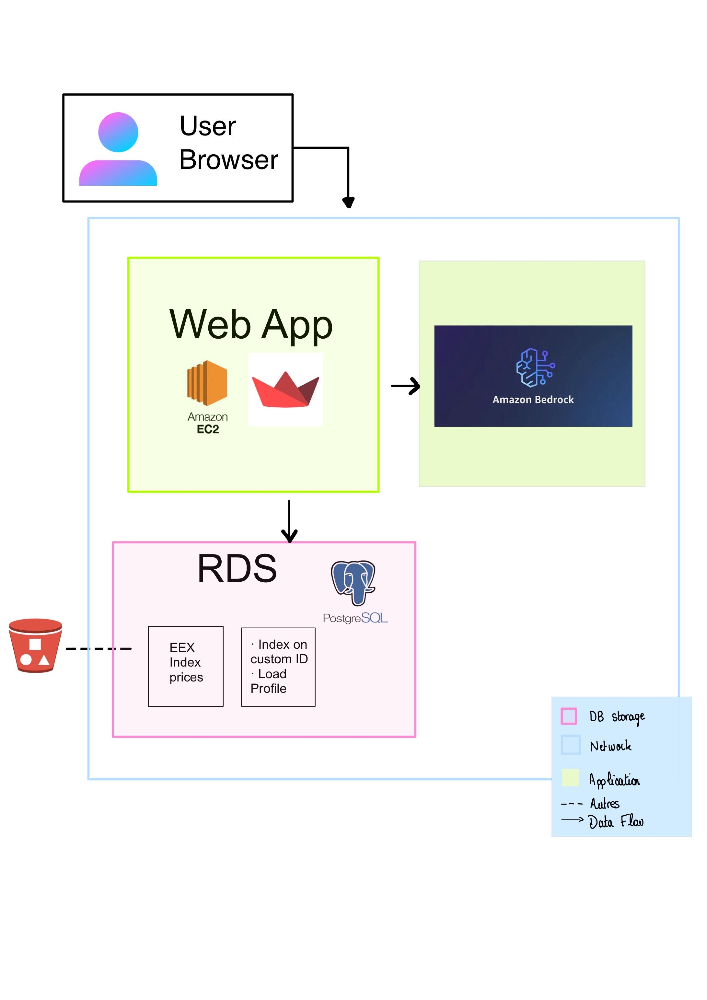

# Energy Asset Simulator

A Streamlit-based tool to help households understand how adding solar PV, batteries, and electric vehicles could affect their electricity bills under different tariff structures.

## Features

- **Customer Profiles**: Pre-loaded consumption data from 5 sample households
- **Asset Simulation**: 
  - Solar PV systems (3-15 kWp)
  - Home batteries (5-20 kWh)
  - Electric vehicle charging (configurable driving distance and schedule)
- **Tariff Comparison**: Three tariff types
  - Dynamic (hourly varying prices)
  - Fixed 3-Year (constant rate)
  - Day/Night (time-of-use pricing)
- **Interactive Visualizations**:
  - Bill comparison charts
  - Load profiles
  - Self-sufficiency metrics
  - Monthly cost trends

## Architecture



## Installation

```bash
# Create virtual environment (optional but recommended)
python -m venv venv
source venv/bin/activate  # On Windows: venv\Scripts\activate

# Install dependencies
pip install -r requirements.txt
```

## Usage

```bash
streamlit run app.py
```

The app will open in your browser at `http://localhost:8501`

## Configuration

Tariff rates can be modified in `config/tariffs.yaml`. The file includes:
- Base monthly fees
- Hourly price profiles (for dynamic tariff)
- Day/night rates
- Feed-in tariffs for solar export
- Asset default parameters

## Project Structure

```
hackaton/
├── app.py                    # Main Streamlit application
├── config/
│   └── tariffs.yaml          # Configurable tariff definitions
├── data/
│   └── customers/            # Pre-loaded customer consumption CSVs
├── src/
│   ├── __init__.py
│   ├── data_loader.py        # Load & process consumption data
│   ├── assets.py             # PV, EV, Battery simulation models
│   ├── billing.py            # Bill calculation for each tariff
│   └── charts.py             # Plotly visualization helpers
├── requirements.txt
└── README.md
```

## Data Format

Customer consumption files should be CSV with two columns:
- `timestamp`: DateTime in format `YYYY-MM-DD HH:MM:SS`
- `value`: Consumption in kWh for each 15-minute interval

## Database Setup (Optional)

The app can read customer data from PostgreSQL instead of CSV files.

### Local Development with Docker

```bash
# Start PostgreSQL
docker compose up -d

# Load CSV data into the database
python scripts/load_csv_to_postgres.py
```

### Production (RDS)

In production, the database and data already exist. Just configure the environment variables to point to your RDS instance - no initialization needed.

### Environment Variables

| Variable | Default | Description |
|----------|---------|-------------|
| `POSTGRES_HOST` | `localhost` | Database host (use RDS endpoint for production) |
| `POSTGRES_PORT` | `5432` | Database port |
| `POSTGRES_USER` | `energy` | Database user |
| `POSTGRES_PASSWORD` | `energy123` | Database password |
| `POSTGRES_DB` | `energy_maestro` | Database name |

### Database Schema

```sql
-- Customer consumption data
CREATE TABLE metrics (
    ts TIMESTAMP,
    value NUMERIC,
    customer_id TEXT
);

-- Market prices (EPEX spot prices)
CREATE TABLE market_prices (
    id SERIAL PRIMARY KEY,
    ts TIMESTAMP NOT NULL,
    price_eur_per_kwh NUMERIC NOT NULL
);
```

- Customer data: each row has `customer_id` (e.g., `customer_1`)
- Market prices: 15-minute interval spot prices in EUR/kWh